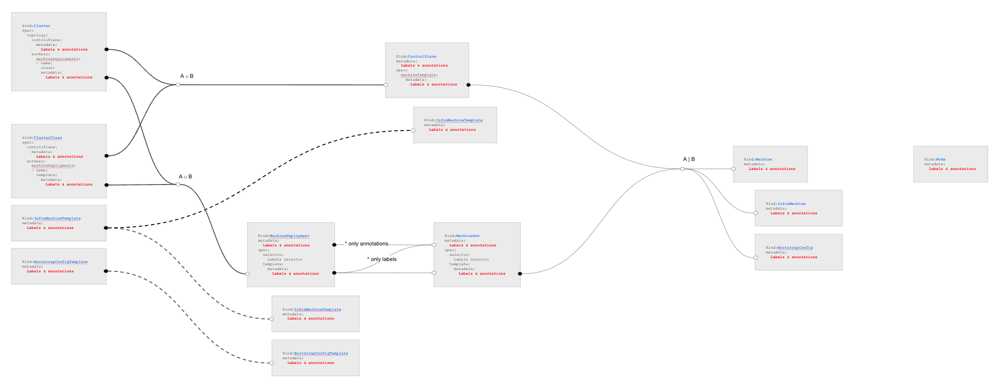
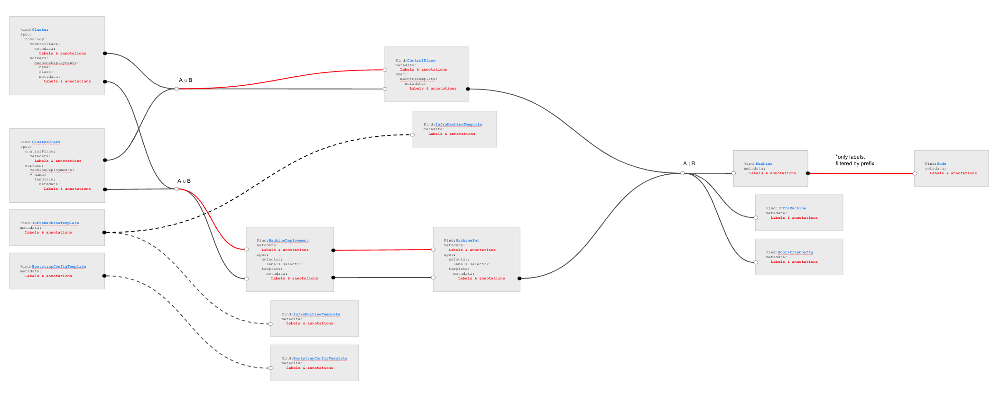

---

title: In place propagation of changes affecting Kubernetes objects only
authors:
- "@fabriziopandini"
  reviewers:
- @sbueringer
- @oscar
- @vincepri
  creation-date: 2022-02-10
  last-updated: 2022-02-26
  status: implementable
  replaces:
  superseded-by:

---

# In place propagation of changes affecting Kubernetes objects only

## Glossary

Refer to the [Cluster API Book Glossary](https://cluster-api.sigs.k8s.io/reference/glossary.html).

## Summary

This document discusses how labels, annotation and other fields impacting only Kubernetes objects or controller behaviour (e.g NodeDrainTimeout)
propagates from ClusterClass to KubeadmControlPlane/MachineDeployments and ultimately to Machines.

## Motivation

Managing labels on Kubernetes nodes has been a long standing [issue](https://github.com/kubernetes-sigs/cluster-api/issues/493) in Cluster API.

The following challenges have been identified through various iterations:

- Define how labels propagate from Machine to node.
- Define how labels (and annotations) propagate from ClusterClass to KubeadmControlPlane/MachineDeployments and ultimately to Machines.
- Define how to prevent that label (and annotation) propagation triggers unnecessary rollouts.

The first point is being addressed by [Label Sync Between Machine and underlying Kubernetes Nodes](link to the proposal as soon as it merge),
while this document tackle the remaining two points.

During a preliminary exploration we identified that the two above challages apply also to other info impacting only Kubernetes objects or
controller behaviour (see e.g. [Support to propagate properties in-place from MachineDeployments to Machines](https://github.com/kubernetes-sigs/cluster-api/issues/5880)).

As a consequence we have decided to expand this work to consider how to propagate both labels and info impacting only Kubernetes objects or
controller behaviour, as well as this related issue: [Labels and annotations for MachineDeployments and KubeadmControlPlane created by topology controller](https://github.com/kubernetes-sigs/cluster-api/issues/7006).

### Goals

- Define how labels (and annotations) propagate from ClusterClass to KubeadmControlPlane/MachineDeployments, and ultimately to Machines.
- Define how info impacting only Kubernetes objects or controller behaviour propagate from ClusterClass to KubeadmControlPlane
  MachineDeployments, and ultimately to Machines.
- Define how to prevent that propagation of labels, annotation and other fields impacting only Kubernetes objects or controller behaviour
  doesn't triggers unnecessary rollouts.

### Non-Goals

- Discuss the immutabiliy core design principle in Cluster API (on the countrary, this proposal makes immutability even better by enanching
  criteria defining when we trigger Machine rollouts).
- To support in-place mutation for components or setting that exists on the Machines (this proposal focuses only on labels, annotation and other
  fields impacting only Kubernetes objects or controller behaviour).

### Future-Goals

- Expand propagation rules including MachinePools after the [MachinePools Machine proposal]() is implemented.

## Proposal

### User Stories

#### Story 1

As a cluster admin/user, I would like a declarative and secure means by which to assign roles to my nodes by acting on Cluster.Topology metadata
(for Clusters with ClusterClass).

As a cluster admin/user, I would like a declarative and secure means by which to assign roles to my nodes by acting on KubeadmControlPlane
MachineDeployments (for Clusters without ClusterClass).

#### Story 2

As a cluster admin/user, I would like to change labels or annotations on Machines without triggering Machine rollout.

#### Story 3

As a cluster admin/user, I would like to change nodeDrainTimeout on Machines without triggering Machine rollout.

#### Story 4

As a cluster admin/user, I would like to set autoscaler labels for MachineDeployments by changing Cluster.Topology metadata
(for Clusters with ClusterClass).

### Implementation Details/Notes/Constraints

### Metadata propagation

The following schema represent how metadata propagation works today (also documented in [book](https://cluster-api.sigs.k8s.io/developer/architecture/controllers/metadata-propagation.html)).

With this proposal we are suggesting to improve metadata propagation according as described in the following schema:

Following paragraphs provide more details about the proposed changes.

#### Propagation of metadata from ClusterClass and Cluster Topology

This change ensure that metadata from ClusterClass and Cluster Topology propagate consistently, in the sense that each set of labels and
annotations will be applied in the same way to all the corresponding targets, more specifically:

1. Metadata from ClusterClass.Spec.ControlPlane and Cluster.Spec.Topology.ControlPlane apply consistently to:
- The ControlPlane object, e.g. KubeadmControlPlane (both top level metadata and spec.machineTemplate.metadata).
- The InfrastructureMachineTemplate object eventually referenced by the ControlPlane (top level metadata only).

2. Metadata from ClusterClass.Spec.Workers.MachineDeployments and Cluster.Spec.Workers.Topology.ControlPlane apply consistently to:
- The MachineDeployment objects (both top level metadata and spec.template.metadata).
- The InfrastructureMachineTemplate object referenced by the MachineDeployment (top level metadata only).
- The BottstrapTemplate object referenced by the MachineDeployment (top level metadata only).

Please note that above changes solves [Labels and annotations for MachineDeployments and KubeadmControlPlane created by topology controller](https://github.com/kubernetes-sigs/cluster-api/issues/7006);
also, we are stopping to propagate existing labels on ClusterClass templates to objects created from them in favor of always
propagating the same set of labels as described above.

Note: as of today topology controllers already propagates ClusterClass and Cluster Topology metadata changes in place when possible
in order to avoid unnecessary template rotation with the consequent Machine rollout; we do not foresee changes to this logic
in order to support above propagation rules.

#### Simplified Metadata propagation from MachineDeployment to MachineSet

We are going to drop current behaviour inherited from Kubernetes's Deployment controller, that computes top level labels in MachineSet
using a different source from the one used for annotations. Instead we propose a more straight forward propagation:

1. Top level metadata from MachineDeployment propagates to top level metadata in MachineSet.
2. spec.template.metadata from MachineDeployment propagates to spec.template.metadata in MachineSet.

In order to prevent unnecessary rollouts, the above propagation should happen in place (see [in place propagation](#in-place-propagation));
same considerations apply to metadata propagation from MachineSet to machines.

#### In Place Metadata propagation from KubeadmControlPlane to Machines

In order to prevent unnecessary rollouts, metadata propagation from KubeadmControlPlane to Machines should happen in place (see [in place propagation](#in-place-propagation)).

#### Label Sync Between Machine and underlying Kubernetes Nodes

As discussed in [Label Sync Between Machine and underlying Kubernetes Nodes](link to the proposal as soon as it merge) we are propagating from
the Machine to corresponding Kubernetes Node only labels with a well known prefix or a well known domain.

### Propagation of fields impacting only Kubernetes objects or controller behaviour

Apart from labels and annotations, there are also other fields that flow downs from ClusterClass to KubeadmControlPlane/MachineDeployments and
ultimately to Machines.

Some of them can be considered like labels and annotations, because they have impacts only only Kubernetes objects or controller behaviour, but
not on the actual machine itself (including infrastructure ande the software running on it). 
Examples are `MinReadySeconds`, `NodeDrainTimeout`, `NodeVolumeDetachTimeout`, `NodeDeletionTimeout`.

Propagation of changes to those fields will be implemented using the same [in place propagation](#in-place-propagation) mechanism implemented
for metadata .

### In place propagation

With in place propagation we are referring to a mechanism that updates existing Kubernetes objects, like MachineSets or Machines, instead of
creating a new instance with the updated info and deleting the current Kubernetes object.

The main benefits of this approach is that it prevents unnecessary rollouts of the corresponding infrastructure, with the consequent creation/
deletion of a Kubernetes node and drain/scheduling of workloads hosted on the machine being deleted.

**Important!** in place propagation of changes as defined above applies only to metadata changes or to fields impacting only Kubernetes objects
or controller behaviour. This approach can not be used to apply changes to the infrastructure hosting a Machine, to the OS or any software
installed on it, Kubernetes components included (Kubelet, static pods, CRI etc.).

Implementing in place propagation has two distinct challenges:

- Current rules defining when MachineDeployments or KubeadmControlPlane triggers a rollout should be modified in order to ignore metadata and
  other fields that are going to be propagated in place.

- When implementing the reconcile loop that performs in place propagation, it is required to avoid impacts on other components applying
  labels or annotations to the same object; for example, when reconciling labels to a Machine, Cluster API should take care of reconcilying
  only the labels he manage, without changing any label applied by the users/by another controller on the same Machine.

#### MachineDeployment rollouts

The MachineDeployment controller determines when a rollout is required using a "semantic equality" comparison between current MachineDeployment
spec and the corresponding MachineSet spec.

While implementing this proposal we should change the definition of "semantic equality" in order to exclude metadata and fields that
should be updated in place.

On top of that we should also account the use case where, after deploying the new "semantic equality" rule, there is already one or more
MachineSet matching the MachineDeployment; in this case Cluster API deterministically pick the oldest of them.

When exploring the solution for this proposal we discovered that the above approach can cause turbulence in the Cluster because it does not
keep into account where the machines are, and as a consequence a Cluster API upgrade could lead to a rollout with machines moving from
a "semantically equal" MachineSet to another, which is an unnecessary operation.

In order to prevent this we are modifying the MachineDeployment controller in order to pick the "semantically equal" MachineSet with more
machines on it, thus avoiding or minimizing turbulence in the Cluster.

##### What about hash

The MachineDeployment controller relies on a label with an hash values to identify machines belonging to a MachineSet; also, the hash value
is used as suffix for the MachineSet name.

Currently the hash is computed using an algorithm that consider the same set of information used to determine "semantic equality" between current
MachineDeployment spec and the corresponding MachineSet spec.

When exploring the solution for this proposal we decided above algorithm can be simplified by using a simple random string
plus a check that ensures that the random string is not already taken by an existing MachineSet (for this MachineDeployment).

The main benefit of this change is that we are going to decouple "semantic equality" from computing a UID to be used for identifying machines
belonging to a MachineSet, thus making the code easier to understand and simplifying future changes on rollout rules.

#### KCP rollouts

#### Avoiding conflicts with other components

## Alternatives

## Implementation History

- [ ] 10/03/2022: First Draft of this document